# Книга Правил Entanglion

> Игра от IBM Research

**2 ИГРОКА | Возраст 14 и старше | 45 МИНУТ**

В Entanglion вам предстоит использовать свои навыки космической навигации и стратегического планирования для того, чтобы исследовать новую галактику и восстановить древний квантовый компьютер.

http://ibm.biz/entanglion

> 🤔 Смущены правилом? Пожалуйста, посмотрите [опечатки](Errata.md) для уточнения правил и обновлений игры.Добро пожаловать в квантовую вселенную, капитан!

# Welcome to the quantum universe, Captain!

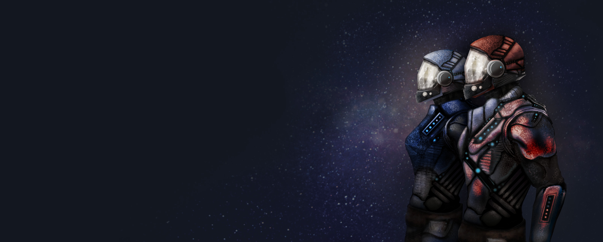

Поздравляем, ваш капитан вышел на пенсию и оставил вас ответственным за галактическое судоходство! Теперь пришло время сделать некоторые обновления.

В течение многих лет вы были одержимы слухами о древней технологии квантовых вычислений, которая могла бы в корне изменить. галактических транспортировку грузов. (???????) Если бы слухи были правдой, это позволило бы вашим кораблям вычислять гиперпространственные пути за считанные секунды! Есть только одна проблема: древние разбирали их квантовый компьютер из-за опасений, что он слишком мощный, и оставили компоненты, разбросанные по планетам, в сильно(???) охраняемой галактике Энтанглион.

Если вы хотите восстановить эту невероятную технологию, вам придется перемещаться своими кораблями через галактику Энтанглион и обходить оборону, оставленную древними. Хорошая новость заключается в том, что ваш старый капитан оставил вам достаточно денег, чтобы оснастить свои корабли квантовыми двигателями, необходимыми для входа в Энтанглион. Плохая новость заключается в том, что без квантового компьютера, который им управляет, эти двигатели могут быть немного ... непредсказуемыми.

Думаешь, ты готов принять вызов?

# Цель
Entanglion - это кооперативная настольная игра, рассчитанная на двух игроков. Ваша цель состоит в том, чтобы восстановить квантовый компьютер, разработанный древней расой. Работайте вместе со своим товарищем по команде, чтобы перемещаться по трем галактикам квантовой вселенной - Centarious, Superious и Entanglion - в стремлении собрать восемь квантовых компьютерных компонентов. Будьте осторожны, чтобы избежать обнаружения планетарными защитными механизмами, охраняющими компоненты квантового компьютера!

# Концепции игры
Entanglion был разработан, чтобы познакомить игроков с несколькими фундаментальными понятиями в квантовых вычислениях:: 

- **Кубиты** являются строительными блоками квантовых вычислений.
- **Суперпозиция** это когда квантовая система может существовать в вероятностной комбинации нескольких состояний одновременно..
- **Квантовая запутанность** наступает, когда состояние одного кубита коррелирует с состоянием другого кубита.
- **Измерение** это процесс наблюдения классического значения кубита.
- **Ошибка** происходит, когда случайный шум в квантовой системе вносит неопределённость в измеренное значение кубита.

Entanglion также предоставляет игрокам различные виды аппаратных и программных компонентов, участвующих в создании реального квантового компьютера.

Дальнейшее обсуждение того, как Entanglion относится к фактическим квантовым вычислениям, можно найти в конце этой книги.

# Подготовка к игре
1. **Выложите поля для игроы и космических кораблей**. Разместите игровое поле в пределах легкой досягаемости от
каждого игрока и раздайте поля космических кораблей каждому игроку.
2. **Поместите квантовые компоненты(???)**. Перемешайте квантовые компоненты и поместите их лицом вверх на каждую планету в галактике Entanglion, по одному на планету.
3. **Перемешайте стопку карт двигателя**. Отложите карту PROBE и перемешайте оставшиеся карты двигателя. Поместите карту PROBE лицевой стороной вниз на стопку двигателя, затем положите оставшиеся карты двигателя сверху лицевой стороной вниз.
4. **Подготовка колоды квантовых событий**. Отложите карту Quantum Shuffle и перемешайте оставшиеся карты событий. Выложите три карты событий лицевой стороной вниз на место для квантовых событий. (??????) Затем поместите карту Quantum Shuffle лицевой стороной вниз в колоду.  Наконец, поместите оставшиеся карты событий в колоду лицевой стороной вниз.
5. **Установите начальный уровень обнаружения**. Поместите жетон уровня обнаружения на шкалу уровня обнаружения. Для простой игры начните с уровня обнаружения 1 или 2. Для более сложной игры начните с уровня обнаружения 3. Если уровень обнаружения достигает конечного уровня (X) до того, как квантовый компьютер будет построен, игра заканчивается прогрышем команды.
6. **Определить первого игрока**. Выберите первого игрока по с помощью броска кубика Entanglion (8-гранный). Игрок с большим результатом ходит первым. Перебросьте кубик в случае равных результатов.
7. **Определите начальные местоположения корабля**. Начиная с первого игрока, бросьте кубик Centarious, чтобы разместить каждый космический корабль (0 - переход к  ZERO , 1 - переход к  ONE ). Этот процесс сродни инициализации квантовой системы.
8. **Возьмите карты двигателя**. Начиная с первого игрока, каждый игрок берет три карты двигателя в свою руку.  Карты двигателя можно держать открытыми.

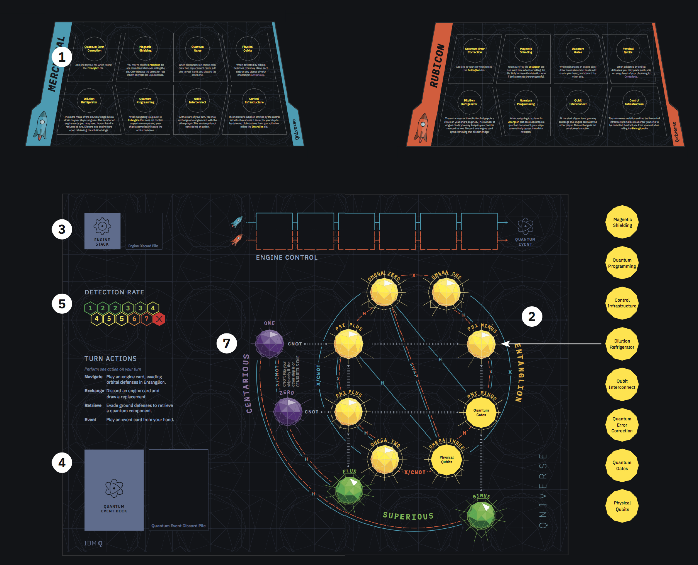

# Материалы (???)

**Доски**
- 1 игровая доска
- 2 доски кораблей

**Карты**
- 24 Карты двигатеся (8 H, 7 CNOT, 5 X, 3 SWAP, 1 PROBE)
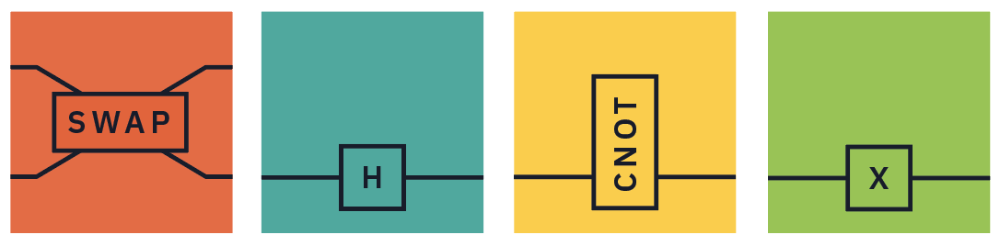

- 9 карт событий

**Компоненты**
- 1 жетон уровня обнаружения
- 8 квантовых компонентов(частей??)
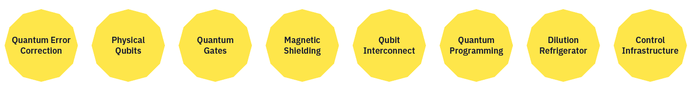

- 1 кубик Centarious (фиолетовый двузначный(бинарный??) d6)
- 1 кубик Entanglion (желтый d8)
- 2 жетона кораблей

**Книга правил**

# Карты двигателя

Карты двигателя используются для перемещения ваших кораблей по квантовой вселенной. Навигационные пути на игровом поле помечены картой (картами), необходимыми для их прохождения (например «X/CNOT»  означает, что для прохождения этого пути можно использовать X или CNOT). В некоторых случаях только один космический корабль может пройти путь. Карты двигателя могут быть разыграны без эффекта, если на доске не показан переход.

**X (Вентиль Паули X)**. X используется для навигации между  ZERO  и  ONE  и внутри галактики Entanglion.

**H (Преобразование Адамара)**. H используется, чтобы путешествовать между Centarious и Superious, а также внутри галактики Entanglion.

**SWAP (обмен)**. За пределами Entanglion SWAP обменивается позициями двух космических кораблей. Внутри Entanglion SWAP переводит космические корабли только между  OMEGA ZERO  и  OMEGA THREE .

**CNOT (Контролируемое отрицание)**. CNOT используется для входа в галактику Entanglion и навигации внутри нее. Он также меняет положение вашего космического корабля в Centarious, но только тогда, когда другой космический корабль находится на орбите  ONE .

**PROBE (Измерение)**. Всякий раз, когда берется PROBE, ваши корабли обнаружеваются древним оборонительным зондом! Бросьте кубик Entanglion. Если результат меньше 4 (после учета эффектов квантовых компонентов), увеличьте уровень обнаружения на единицу. В противном случае, PROBE не имеет никакого эффекта.  Сбросьте курту PROBE и возьмите карту двигателя на замену.

> Расположите карты двигателя в местах управления двигателем так, чтобы линии на карте совпадали с линией вашего космического корабля.

> Когда стопка двигателей истощается, немедленно перетасуйте карты двигателя в стопке сброса, чтобы пополнить стопку двигателей.  Включите PROBE в случайном порядке, не помещайте это в основание колоды.

# Обзор хода
Выполните _одно_ из следующих действий на вашем ходу.

1. **Навигация**. Сыграйте одну карту двигателя из системы управления двигателем, чтобы перемещаться по галактике, и затем возьмите карту ей на замену. Вы можете играть карты двигателя только для своего корабля.
2. **Обмен**. Сбросьте одну карту двигателя из вашей руки и возьмите карту ей на замену.
3. **Получение квантового компонента**. Бросьте кубик Entanglion, чтобы попытаться получить квантовый компонент, если он есть.
4. **Событие**. Разыграйте карту событий из своей руки (если она у вас есть).

> Игроки не могут пропустить свои ходы, они должны выполнить одно из указанных выше действий.

# Вход и выход из Entanglion
Чтобы войти в Entanglion, один космический корабль должен быть в Centarious, а другой - в Superious. Только космический корабль в Centarious может использовать CNOT для входа в Entanglion. Пути в Entanglion обозначены серыми линиями на игровом поле.

Ведущий космический корабль (играет на CNOT)  | Другой космический корабль | Место назначения
--- | --- | ---
 ZERO  |  PLUS  |  PHI PLUS 
 ZERO  |  MINUS  |  PHI MINUS 
 ONE  |  PLUS  |  PSI PLUS 
 ONE  |  MINUS  |  PSI MINUS 

It is also possible to exit Entanglion using CNOT when both ships are orbiting  PHI PLUS ,  PHI MINUS ,  PSI PLUS , or  PSI MINUS . The ship that plays the CNOT returns to Centarious and the other ship returns to Superious, on the planets indicated with the gray lines.

Example: Rubicon is orbiting  ZERO  and Mercurial is orbiting  PLUS . When Rubicon plays a CNOT, both ships move to  PHI PLUS .

> Outside of Entanglion, ships move independently. Inside Entanglion, both ships always move together, irregardless of which player plays an engine card.

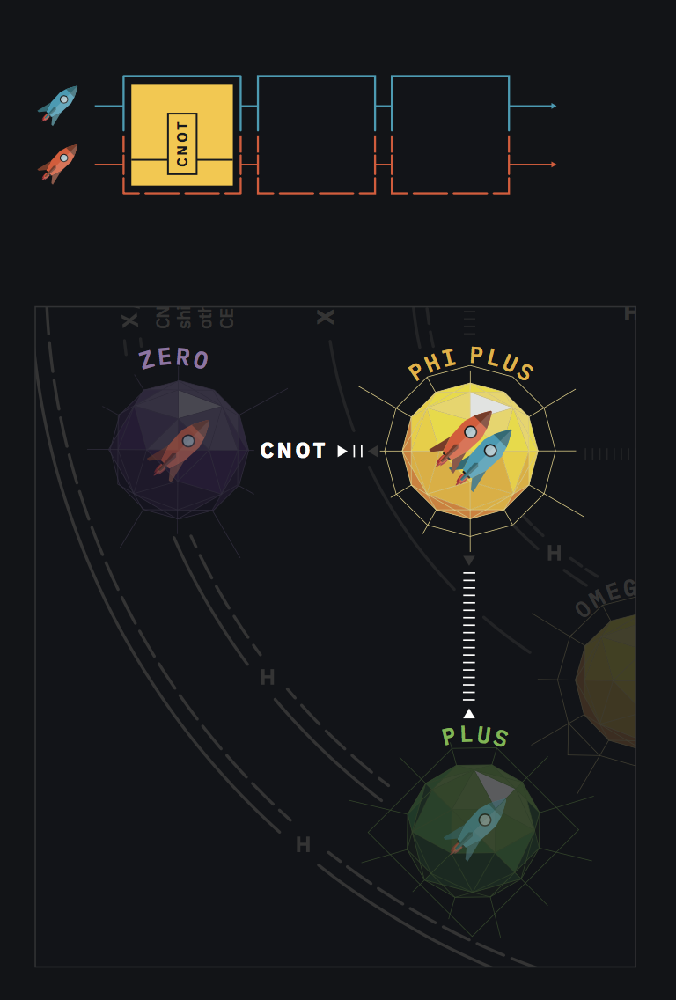

On  PHI PLUS , when Rubicon plays CNOT, Rubicon moves to  ZERO  and Mercurial moves to  PLUS .

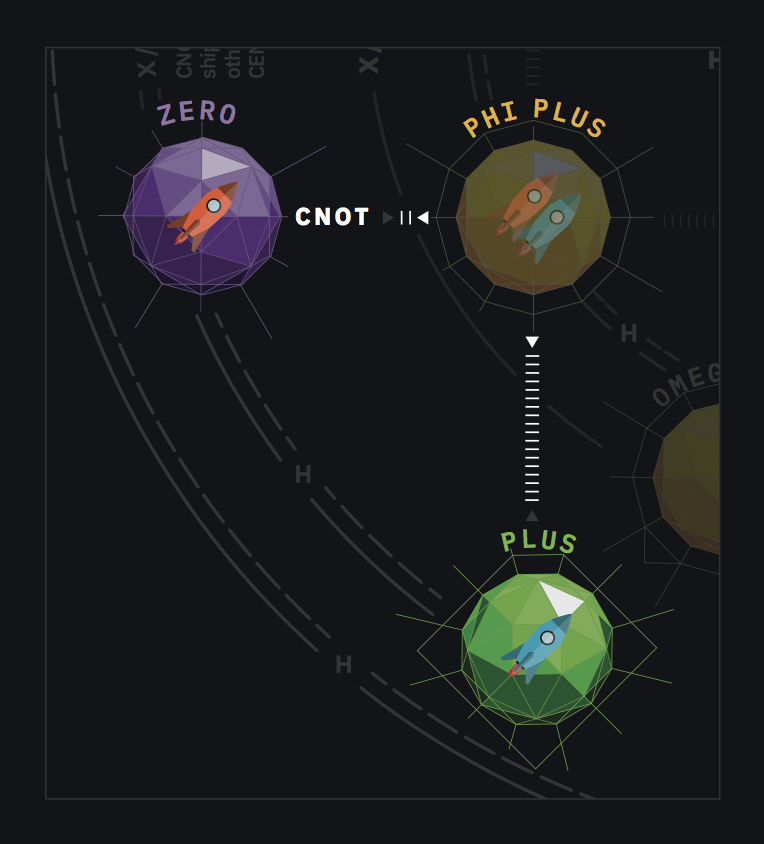

# Detection rate
The detection rate determines the difficulty of successfully evading planetary defenses. The detection rate token is used to keep track of the current detection rate. When a player’s spaceship has been detected by orbital defenses, or a player’s away team has been detected by ground defenses, the detection rate is increased, making it easier for each planet’s defenses 
to detect the player in the future. The game ends when the detection rate reaches the final level (designated with an X).

> The detection rate increases by one whenever you are detected by a planet's orbital or ground defenses.

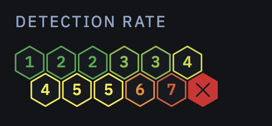

# Orbital defenses
Planets in Entanglion are protected by orbital defenses that scan for ships looking to plunder the quantum components hidden there. It is possible to evade these defenses using your quantum engines. If you are detected, however, your navigation system will automatically take evasive maneuvers and jump to a random planet in the Centarious system. This jump triggers a quantum event.

**When you navigate to any planet in Entanglion:** Roll the Entanglion die. If the outcome is greater than the current detection rate, the orbital defenses have been evaded. If not, perform the following actions:

1. Roll the Centarious die and move both ships to the planet indicated. Both ships jump together.
2. Increase the detection rate by one.
3. Draw a quantum event card and perform the action indicated.

> Physical Qubits lets you decide which planets in Centarious to place your spaceships.

> Quantum Programming lets you bypass orbital defenses when a planet doesn't have a quantum component.

> The Quantum Tunnel event card lets you bypass orbital defenses. If you play this card after entering the orbit of a planet in Entanglion, you do not need to roll the Entanglion die to determine if your ships were detected by orbital defenses.

> When entering Entanglion via the Heisenberg card, you may ignore the orbital defenses.

> If you play an engine card that does not transition your ships to a new planet in Entanglion, you do not need to re-check whether your ships have been detected.

# Quantum components
There are eight components that players must obtain in order to build the quantum computer to win the game, shown on each of the spaceship boards. Each component also grants a permanent special ability or hindrance to your ship, so you must strategize with your teammate to obtain the components in an optimal order!

> Quantum components are permanent upgrades to your ship and alter gameplay for the rest of the game.

When your ships are orbiting a planet with a quantum component, you may send an away team to the planet’s surface to retrieve it. Quantum components are guarded by automated ground defenses which, as with orbital defenses, must be evaded.

**To perform a retrieval mission:** Roll the Entanglion die. If the outcome is greater than the current detection rate, collect the component and place it on your spaceship board. If not, your away team was detected by the ground defenses; increase the detection rate by one.

> If your away team fails to retrieve a quantum component, your ships remain in orbit on the current planet. You do not need to perform another orbital defense check on the next turn unless you navigate to another planet that has orbital defenses

> The Quantum Tunnel event card lets you bypass ground defenses. If you play this card during your turn, your retrieval mission was successful. You do not need to roll the Entanglion die to determine if your away team was detected by ground defenses; add the quantum component to your ship

# Quantum events
Quantum engines can be unpredictable at times! Once all six engine control slots have been filled, perform a quantum event at the end of your turn. In addition, perform a quantum event whenever you have been detected by orbital defenses.

**To perform a quantum event:** Draw an event card and perform the instructions. Clear all engine cards from the game board and put them in engine discard pile.

> When Quantum Shuffle is drawn, reshuffle the quantum event cards as per the instructions in game setup.

> In the event that your ship was detected by orbital defenses on the same turn as having filled all six engine control slots, perform two quantum events.

# Game end
Players immediately win the game when they have collected all eight components of the quantum computer. Players immediately lose the game when the detection rate reaches the end (X).

# Your first game
Set up the game board as described in Setup. In this game, Mercurial (the blue player) will go first. Mercurial draws three cards: X, H, and H. Rubicon draws three cards: CNOT, SWAP, and X. Both ships start on  ZERO .

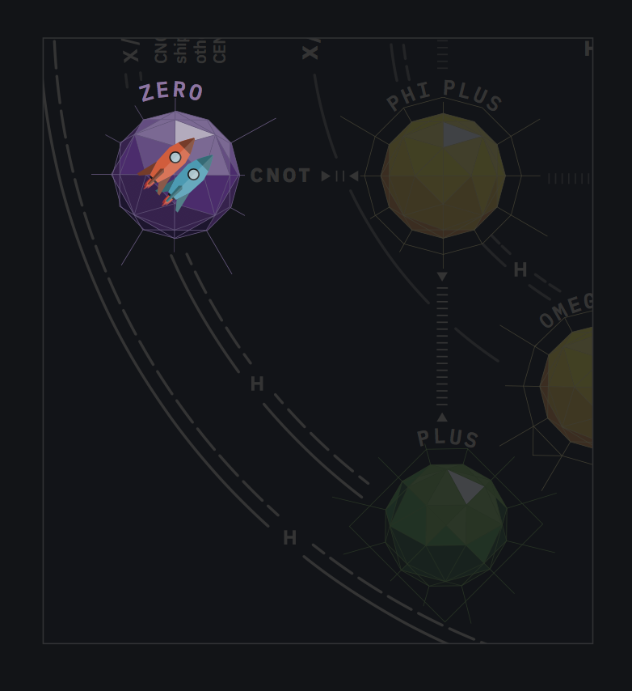

1. Mercurial plays an H to navigate to  PLUS . Mercurial draws X as a replacement card.

2. Rubicon plays CNOT to navigate both ships to  PHI PLUS . Rubicon draws H as a replacement card. After arriving at a planet in Entanglion, Rubicon must roll the Entanglion die to evade the orbital defenses. Since the detection rate is 1, Rubicon needs to roll a 2 or higher. Rubicon rolls the Entanglion die and gets a 3, just enough to evade detection!

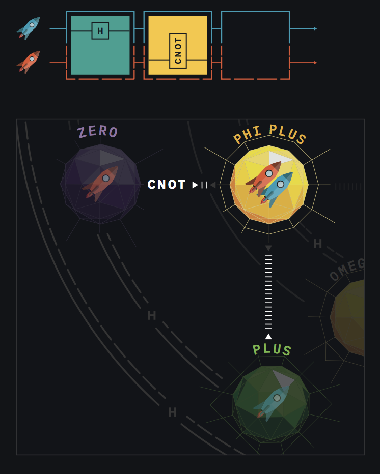

3. Mercurial decides to retrieve the Quantum Gates present on  PHI PLUS . Mercurial rolls a 6, much higher than the detection rate of 1, and successfully retrieves the component.

4. Rubicon decides the next destination is  OMEGA TWO  and plays an H to navigate both ships there.

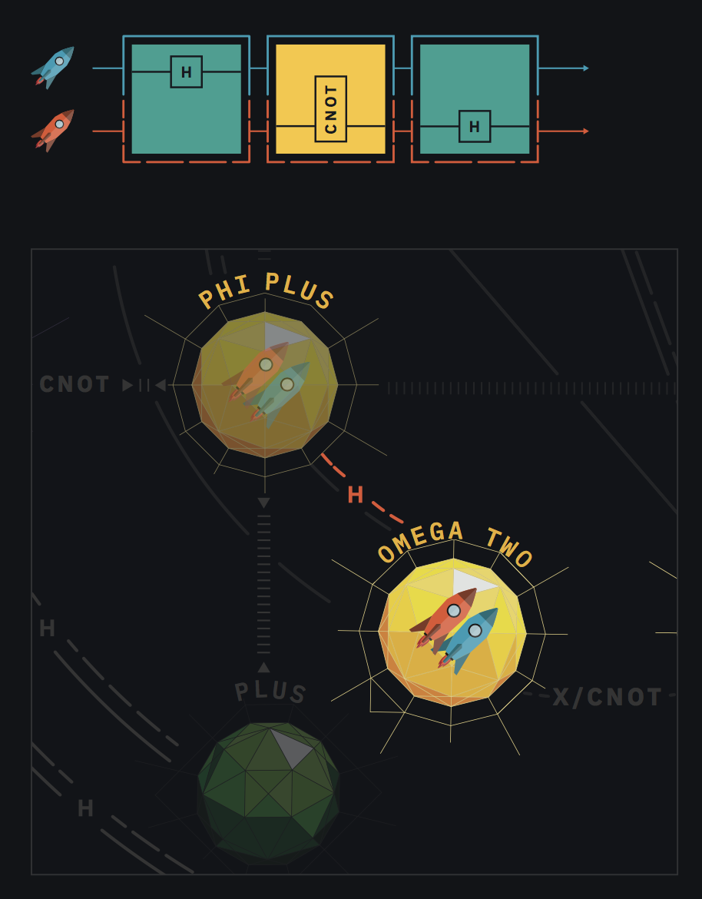

Rubicon rolls the Entanglion die and it comes up as 1. The ships have been detected, so they must retreat! Rubicon rolls a 1 on the Centarious die, so both ships jump back to  ONE . Since they were detected, the detection rate is increased by 1 and a quantum event is triggered. Rubicon draws a quantum event card – Heisenberg – which can be used on a future turn.

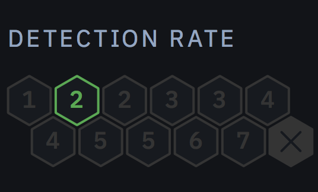

Play continues until either Rubicon and Mercurial have collected all of the quantum components in Entanglion, or until the detection rate reaches the final level.

# How Entanglion relates to quantum computing
Entanglion models several aspects of a 2-qubit quantum computer. Specifically, the two spaceships represent two qubits, and each planet in each galaxy represents a different state of those qubits. Engine cards represent the quantum gates used to transition the qubits into different states.

The Centarious galaxy represents the classical states of 0 and 1, written in "ket notation" as ⎢0 〉( ZERO ) and ⎢1 〉( ONE ). The Superious galaxy represents states of quantum superposition, known as ⎢+ 〉( PLUS ) and ⎢- 〉( MINUS ). The Entanglion galaxy represents states of entanglement. Four of the entangled states, ⎢Ψ+ 〉( PSI PLUS ), ⎢Ψ- 〉( PSI MINUS ), ⎢Φ+ 〉( PHI PLUS ), and ⎢Φ- 〉( PHI MINUS ), are known as the [Bell states](https://en.wikipedia.org/wiki/Bell_state). The other entangled states, which we have labeled ⎢ω0 〉( OMEGA ZERO ) through ⎢ω3 〉( OMEGA THREE ), are additional states that are achievable through the combined operation of the X, H, SWAP, and CNOT gates.

The requirement that both ships must move together within Entanglion is a result of the fact that for entangled states, the state of the system is more complex than a simple combination of the states of the individual qubits. This is one of the main ways in which quantum mechanics differs from classical physics.

## Engine cards
The engine cards represent _some_ of the different kinds of quantum logic gates used by quantum computers.

- **X**. The X gate flips the value of a qubit. It is also known as the bit flip gate.
- **SWAP**. SWAP exchanges the values of the two qubits.
- **CNOT**. CNOT stands for "Controlled Not." It needs two qubits to work: one qubit is designated the "target," which gets flipped if the other qubit, known as the "control," has a value of 1.
- **H**. The Hadamard gate is used to create or collapse superposition. It is one of the most important gates in quantum computing.

## Quantum components
The quantum components in Entanglion represent different physical or logical components needed to construct an actual quantum computer.

- **Физические кубиты**. Much like how classical computer processors are implemented via hardware transistors, quantum processors are implemented via hardware qubits. There are a [number of different ways](https://en.wikipedia.org/wiki/Qubit#Physical_representation) scientists are creating physical qubits, including Josephson junctions, ion traps, and quantum dots.
- **Qubit Interconnect**. Qubits must be physically connected to each other in order to become entangled with one another.
- **Dilution Refrigerator**. Physical qubits must be kept at very cold temperatures – colder even than outer space – in order to maintain their coherence. Dilution refrigerators are able to cool physical qubits to temperatures as low as 2 millikelvin.
- **Quantum Gates**. In classical computing, logical gates such as AND, OR, NOT, and NAND are combined to create higher-order computation. In quantum computing, quantum gates such as X, CNOT, SWAP, and H are used for computation.
- **Quantum Programming**. In order to improve the productivity of quantum programmers, higher-level quantum programming languages are needed. For example, [IBM OpenQASM](https://github.com/IBM/qiskit-openqasm) allows you to program a quantum computer with an assembly-style language, and [IBM QISKit](https://qiskit.org) allows you to program a quantum computer in Python.
- **Quantum Error Correction**. Physical qubits experience noise that may cause errors to occur during measurement. [Quantum error correction](https://en.wikipedia.org/wiki/Quantum_error_correction) is used to correct for these errors. The key insight of quantum error correction is to use multiple physical qubits to simulate one logical qubit.
- **Control Infrastructure**. Quantum computers need some way to measure the internal state of a qubit. Control infrastructure uses microwave radiation to read the state of a qubit and digitize it into a binary state (0 or 1).
- **Magnetic Shielding**. Qubits are extremely sensitive to stray magnetic fields. Magnetic shielding ensures qubits are protected from external sources of magnetism.

## Event cards
Event cards add fun, random elements to the game. Some event cards are named after people who made significant contributions to the field of quantum physics and quantum information science, such as Werner Heisenberg and Erwin Schrödinger. One event card is extra special, named after IBM researcher Charles Bennett, one of the founders of quantum information theory and a key contributor to the discovery of the quantum teleportation effect. Other event cards are named after quantum effects such as quantum tunneling, bit flip errors, wave function collapsing, and Einstein’s "spooky action at a distance." We encourage avid players to research these people and topics to learn more about the physics of quantum information!

## Defenses, measurement, and error
The process of encountering orbital defenses when navigating the Entanglion galaxy is akin to performing a classical measurement (also known as a Z measurement) on the quantum state. Additionally, the act of retrieving a quantum component is akin to performing an entanglement measurement, also known as a [Bell test](https://en.wikipedia.org/wiki/Bell_test_experiments). Sometimes, noise in the quantum system prevents us from seeing a reliable measurement. We call this a readout error. The effects of noise and errors are modeled via the detection rate.

## Additional resources
We recommend a few resources for learning more about quantum computing.

- [IBM Q Experience Beginner's Guide](http://ibm.biz/qx-guide) by IBM Research
- [Q is for Quantum](http://a.co/iJbiNS8) by T. Rudolph
- [Quantum Computing for Computer Scientists](http://a.co/cCZBoS9) by N. Yanofsky and M. Mannucci
- [Quantum Computation and Quantum Information](http://a.co/coZAko8) by M. A. Nielsen and I. L. Chuang
- [Quantum Computer Science: An Introduction](http://a.co/iYdi4Bv) by N. D. Mermin
- [Quantum Computing Since Democritus](http://a.co/1HzDIgF) by S. Aaronson
